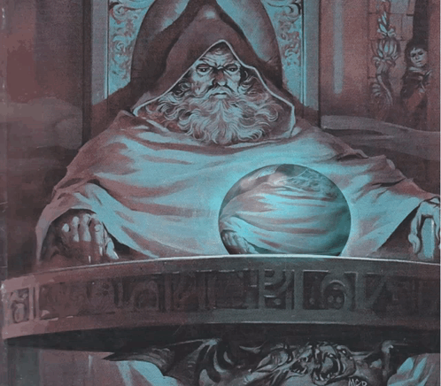

## Hello you~ I'm Antonia Landaeta 👋

- 🎓 I'm a Industrial Engineering undergrad and at the same time I'm pursuing a Master's Degree in Data Science.
- 🔭 I'm currently learning the way of the Data Mage (Scientist): pondering the orb (learning how to use github, VScode, git and more without dying), magic spells (uv commands) and potions (better coding).
- ⭐ 2026's Objective: Sleep well, read more ASOIAF's books and finish Elden Ring.
- ⚡ I love drawing comics and singing.

### **Languages**

### **Libraries**

    
    <a href="mailto:antonia.landaeta@ug.uchile.cl">
        

